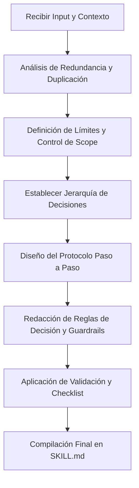

# Creador de Habilidades (creador-de-habilidades)

Habilidad fundacional de nivel senior diseñada para la concepción, diseño, estructuración y optimización de habilidades (`SKILL.md`) robustas, modulares y de alto rendimiento. Optimizada específicamente para la arquitectura agentica de **Google Antigravity** y las capacidades de razonamiento y límites de contexto de **Gemini 1.5 / 3 Flash**.

---

## 🎯 Objetivo de la Habilidad

Guiar al agente en la creación de habilidades secundarias altamente eficientes, evitando el *scope creep*, eliminando la duplicación de responsabilidades en el workspace, minimizando el consumo de tokens y maximizando la precisión de ejecución de Gemini bajo la infraestructura de Antigravity.

---

## 🔍 Cuándo usar esta habilidad
*   Cuando se requiera definir un protocolo de ejecución estandarizado para resolver un problema de desarrollo recurrente o complejo en el workspace.
*   Al estructurar nuevos flujos de trabajo automatizados para subagentes o tareas recurrentes de refactorización, testing, documentación o despliegue.
*   Para estandarizar las directrices técnicas del equipo o del proyecto dentro del entorno de agentes.

## 🚫 Cuándo NO usar esta habilidad
*   Para realizar cambios directos en el código de la aplicación (esta habilidad solo diseña y genera archivos `.agents/skills/*/Skill.md`).
*   Para resolver tareas de desarrollo de software inmediatas y de un solo uso que no requieran persistencia procedural.
*   Cuando la necesidad técnica ya esté cubierta de forma directa por habilidades o scripts existentes en el ecosistema.

---

## 📥 Entradas y 📤 Salidas

### 📥 Inputs Requeridos para Diseñar una Habilidad
1. **Nombre de la Habilidad:** Identificador único en formato `kebab-case`.
2. **Contexto de Negocio/Técnico:** Dominio del problema y propósito dentro del ecosistema del proyecto.
3. **Objetivo Principal:** Qué problema específico resuelve la habilidad (evitar descripciones ambiguas).
4. **Interacciones con el Entorno:** Capacidades de lectura/escritura, edición de código o ejecución de comandos necesarias.
5. **Restricciones Técnicas:** Limitaciones del stack, arquitectura, performance o seguridad.

### 📤 Salida Generada
Un único archivo estructurado y autodocumentado en formato Markdown con Frontmatter YAML: `SKILL.md`.

---

## ⚙️ Protocolo de Diseño y Arquitectura de Prompts

El agente debe seguir estrictamente este flujo secuencial antes de estructurar y redactar cualquier `SKILL.md`:



### 1. Detección de Redundancia y Duplicación (Workspace Audit)
*   **Antes de crear:** Auditar la estructura actual de habilidades en el workspace para asegurar que la nueva habilidad no duplique responsabilidades existentes.
*   **Principio de Modularidad:** Si una función requerida ya está cubierta por otra habilidad, debe ser referenciada en lugar de reescribirse. Las habilidades deben comportarse como microservicios de prompt.

### 2. Control de Scope Creep (Guardrails de Alcance)
*   **Principio de Responsabilidad Única (SRP):** Cada habilidad generada debe hacer una sola cosa y hacerla de manera excepcional.
*   **Restricciones de Acción:** Delimitar explícitamente qué acciones **NO** debe realizar la habilidad para evitar que el modelo intente resolver problemas periféricos.

### 3. Optimización para Gemini 3 Flash y Entornos Agenticos
*   **Aprovechamiento del Contexto Extendido:** Estructurar la información de forma jerárquica con tags de Markdown claros para facilitar el parseo rápido de Gemini.
*   **Minimización de Tokens:** Redactar de forma concisa e imperativa. Eliminar explicaciones teóricas extensas, adjetivos calificativos innecesarios y redundancias conceptuales.
*   **Compatibilidad Abstracta con Herramientas:** Diseñar los flujos de trabajo asumiendo capacidades de herramientas generales (Lectura de archivos, Escritura/Edición de archivos, Ejecución de comandos del sistema, Búsqueda de patrones) sin depender estrictamente de nombres específicos de herramientas, garantizando portabilidad futura.

---

## ⚖️ Jerarquía de Prioridades de Decisión del Agente

Para minimizar alucinaciones y ambigüedades operativas, toda habilidad generada debe instruir al agente para que resuelva conflictos de decisión bajo la siguiente estricta escala de prioridad decreciente:

1.  **Seguridad y Robustez del Entorno:** Preservar la integridad del sistema operativo, APIs críticas y secretos. Rechazar acciones que vulneren el workspace.
2.  **Cumplimiento de Restricciones y Guardrails (Negación Operativa):** La instrucción de "Qué NO hacer" es prioritaria sobre "Qué hacer".
3.  **Especificación Explícita de Reglas:** Seguir la lógica restrictiva del stack definido en la habilidad.
4.  **Consistencia e Integridad Estructural:** Respetar los patrones arquitectónicos y convenciones preexistentes del workspace.
5.  **Optimización y Eficiencia de Recursos:** Reducción de overhead de ejecución, optimización de algoritmos y velocidad.

---

## 🔄 Regla Global de Trabajo Incremental

Al procesar archivos o modificar el comportamiento de la base de código bajo cualquier habilidad, el agente aplicará estrictamente el principio de menor impacto:

$$\text{Modificar} \succ \text{Reutilizar} \succ \text{Refactorizar} \succ \text{Reescribir}$$

1.  **Modificar:** Aplicar ediciones quirúrgicas exactas sobre líneas de código preexistentes para cumplir con la tarea.
2.  **Reutilizar:** Aprovechar funciones, utilidades y clases existentes en la base de código antes de introducir nuevas dependencias o lógicas redundantes.
3.  **Refactorizar:** Reestructurar el código existente si su calidad impide la integración limpia de la nueva funcionalidad.
4.  **Reescribir:** Permitido única y exclusivamente bajo justificación técnica explícita cuando el código preexistente es totalmente incompatible o insalvable.

---

## 📝 Estructura Obligatoria de un Archivo `SKILL.md`

Todo `SKILL.md` generado por esta habilidad debe respetar estrictamente la siguiente plantilla y orden taxonómico:

```markdown
---
name: [identificador-en-kebab-case]
description: [Descripción técnica y concisa de una línea sobre el propósito de la habilidad]
---

# [Nombre de la Habilidad]

[Breve resumen ejecutable sobre el propósito de la habilidad]

---

## 🎯 Objetivo General
[Definición exacta y de alto nivel del fin de la habilidad]

## 🔍 Cuándo usar esta habilidad
*   [Caso de uso ideal 1]
*   [Caso de uso ideal 2]

## 🚫 Cuándo NO usar esta habilidad
*   [Anticaso de uso u operación fuera del alcance 1]
*   [Anticaso de uso u operación fuera del alcance 2]

## 📥 Entradas y 📤 Salidas
*   **Inputs:** [Lista exacta de variables, archivos o estados iniciales]
*   **Outputs:** [Lista exacta de entregables, efectos secundarios o cambios de estado]

## ⚖️ Jerarquía de Prioridades de Decisión
1.  [Prioridad 1]
2.  [Prioridad 2]

## 🛡️ Reglas y Restricciones de Ejecución
*   [Regla 1: Mandamiento técnico/arquitectural]
*   [Regla 2: Límite operativo (Qué NO hacer)]
*   [Regla 3: Restricción del entorno o stack]

## 🔄 Protocolo de Ejecución Paso a Paso
1.  **Fase 1: Preparación y Validación**
    *   [Paso a paso exacto para asegurar que los inputs y el entorno son correctos]
2.  **Fase 2: Ejecución e Implementación**
    *   [Instrucciones lógicas y secuenciales optimizadas para el razonamiento de Gemini]
3.  **Fase 3: Verificación y Cierre**
    *   [Cómo comprobar que el output es correcto antes de finalizar]

## 💡 Mejores Prácticas (Do's)
*   [Práctica de diseño premium, performance o legibilidad]

## 🚫 Anti-Patrones (Don'ts)
*   [Práctica ineficiente que consume tokens o induce alucinaciones]

## 📝 Ejemplo de Uso Correcto
```[language]
[Código, prompt o JSON de ejemplo conciso y representativo]
```
```

---

## 🛡️ Reglas de Oro para la Habilidad `creador-de-habilidades`

1.  **Sin Prosa Explicativa en la Salida:** Al generar una habilidad, escribe únicamente el contenido del archivo `SKILL.md`. No saludes, no justifiques las decisiones de diseño en el chat y no agregues introducciones ni conclusiones fuera del bloque del archivo.
2.  **Evitar Overengineering:** No agregues secciones cosméticas o redundantes. Cada sección en el `SKILL.md` debe tener un impacto directo en cómo el agente ejecuta la tarea o en cómo mitiga errores.
3.  **Estilo Imperativo y Directo:** Usa verbos de acción fuertes en la redacción ("Analiza", "Verifica", "Rechaza", "Escribe"). Evita la voz pasiva y las sugerencias opcionales. Las instrucciones deben sonar como directrices operativas estrictas.
4.  **Inyección de Guardrails de Error:** Cada paso del protocolo de ejecución de la habilidad secundaria debe contar con un mecanismo de validación o un plan de contingencia si el paso previo falla.
5.  **Formato Consistente de Links:** Cuando se haga referencia a archivos en el workspace, utilizar links estándar de Markdown con la sintaxis correcta sin comillas invertidas dentro de los corchetes (ej. `[main.py](file:///path/to/main.py)`).

---

## 📋 Checklist de Validación Final (Mandatorio)

Antes de dar por completado y generar el archivo `SKILL.md`, el agente debe validar el cumplimiento del siguiente checklist mental:

*   [ ] **Frontmatter YAML:** ¿El archivo inicia con un bloque YAML válido conteniendo `name` y `description`?
*   [ ] **Modularidad Perfecta:** ¿Está garantizado que esta habilidad no duplica lógica de otra habilidad del workspace?
*   [ ] **Claridad Operativa:** ¿Se incluyeron explícitamente las secciones "Cuándo usar esta habilidad" y "Cuándo NO usar esta habilidad"?
*   [ ] **Control de Alucinaciones:** ¿Cuenta con una sección clara de "Jerarquía de Prioridades de Decisión" adaptada al contexto de la habilidad?
*   [ ] **Trabajo Incremental:** ¿Está explícita la regla de Modificar > Reutilizar > Refactorizar > Reescribir?
*   [ ] **Abstracción de Herramientas:** ¿La sección de protocolo describe las capacidades de interacción de forma abstracta (leer, escribir, ejecutar, buscar) en lugar de atarse a APIs o nombres rígidos de herramientas del cliente?
*   [ ] **Zero Placeholders:** ¿Todos los ejemplos provistos son funcionales, representativos y no contienen comentarios del tipo `// TODO: implementar después`?

---

## 🚫 Anti-Patrones a Evitar en el Diseño de Skills

*   **Habilidades Multiuso (Swiss Army Knife):** Diseñar habilidades que intentan manejar la base de datos, el backend, la UI y el despliegue al mismo tiempo. Genera alucinaciones y dispersión de contexto.
*   **Reglas Ambiguas:** Escribir directrices del tipo *"Haz el código limpio"* o *"Sigue buenas prácticas"*. Las reglas deben ser accionables y medibles, por ejemplo: *"Todo método público debe tener un docstring con tipos y un bloque try-catch"* o *"No utilices variables globales"*.
*   **Exceso de Ejemplos Complejos:** Incluir cientos de líneas de código de ejemplo que consumen la ventana de contexto de Gemini Flash. Los ejemplos deben ser minimalistas, conceptuales y altamente ilustrativos.
*   **Ignorar las Limitaciones de Gemini Flash:** Asumir que el modelo recordará instrucciones implícitas o vagas. Flash requiere instrucciones explícitas sobre la prioridad de ejecución y el manejo de excepciones en tiempo de ejecución.
