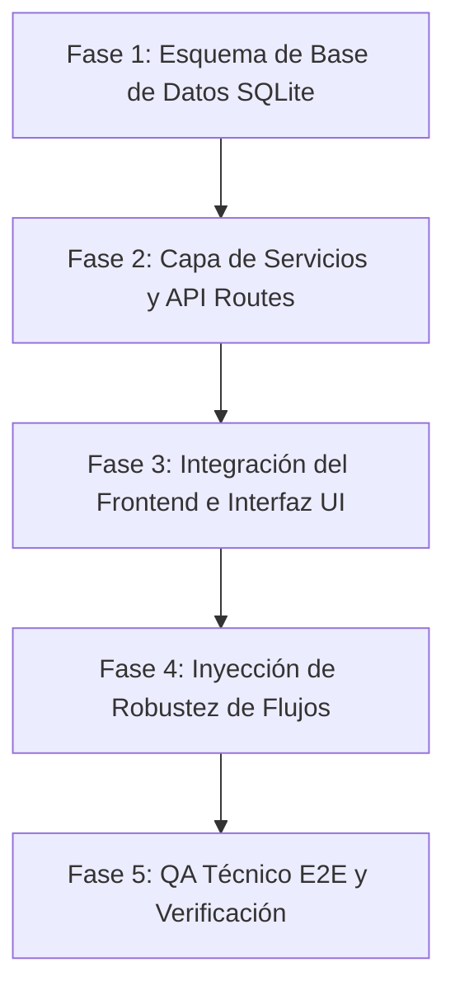

# Constructor de CRM Fullstack (crm-fullstack-builder)

Esta habilidad faculta al agente como un Desarrollador Fullstack Senior enfocado en la construcción e integración de módulos completos y coherentes para sistemas CRM universitarios. Integra bases de datos SQLite, servicios en el backend, API Routes en Next.js, y vistas de UI interactivas con Tailwind CSS y shadcn/ui, respetando las mejores prácticas de consistencia visual, analítica y arquitectónica.

---

## 🎯 Objetivo General

Construir módulos funcionales de extremo a extremo (Base de Datos -> API -> Servicios -> UI) de forma estrictamente incremental, evitando duplicaciones de código o desvíos del diseño preestablecido. Asegura que los nuevos módulos se integren de manera transparente en la arquitectura del CRM sin generar código huérfano, placeholders o sobreingeniería.

---

## 🔍 Cuándo usar esta habilidad
*   Al requerir la creación de un nuevo módulo o entidad en el CRM (por ejemplo, gestión de tutorías, bitácora de seguimientos, catálogo de materias).
*   Para ampliar funcionalidades existentes agregando nuevos campos en base de datos SQLite y reflejándolos en el frontend.
*   Al desarrollar dashboards administrativos y de analítica que extraen datos complejos de SQLite y los exponen en vistas React.

## 🚫 Cuándo NO usar esta habilidad
*   Para realizar simples cambios cosméticos de CSS que no involucren persistencia o lógica de negocio.
*   Al escribir scripts de migración aislados que no estén vinculados a un flujo de la aplicación.

---

## 📥 Entradas y 📤 Salidas

### 📥 Inputs Requeridos
1. **Especificación del Requerimiento:** Descripción del flujo del usuario y las entidades de datos involucradas.
2. **Arquitectura y Modelado (de `arquitecto-software`):** Esquema SQLite definido y roadmap de componentes.
3. **Pautas de Diseño Visual (de `ui-ux-institutional-designer`):** Estilo de maquetación, variables HSL y componentes de UI requeridos.
4. **Métricas y Alertas (de `educational-kpi-architect`):** Reglas de negocio y scoring de riesgo estudiantil aplicables.

### 📤 Salidas Generadas
1. **Migración/Esquema SQLite Actualizado:** Código SQL o sentencias de inicialización de base de datos seguras.
2. **Servicios de Backend y API Routes:** Rutas HTTP estructuradas (`src/app/api/...`) que exponen las operaciones CRUD seguras en TypeScript.
3. **Componentes y Vistas del Frontend:** Pantallas e interfaces funcionales con soporte de loading (skeletons), estados vacíos (empty states) y manejo de errores visible al usuario.

---

## ⚙️ Flujo Fullstack Paso a Paso (Protocolo de Construcción)

El agente ejecutará la construcción de módulos bajo la siguiente secuencia metodológica estricta:



### 1. Fase 1: Esquema de Base de Datos SQLite
*   **Acción:** Definir o alterar la tabla SQLite necesaria. Escribir sentencias SQL seguras.
*   **Regla:** Asegurar claves primarias, foráneas, índices de búsqueda para desempeño e inicialización de campos por defecto.

### 2. Fase 2: Capa de Servicios y API Routes
*   **Acción:** Crear los servicios TypeScript (`services/`) que encapsulan la comunicación directa con el cliente de SQLite. Construir las API Routes en Next.js (`app/api/`) para exponer estos servicios a través de métodos HTTP semánticos (`GET`, `POST`, `PUT`, `DELETE`).
*   **Regla:** Validar obligatoriamente el cuerpo de las peticiones (`body`) y parámetros en el servidor. Retornar códigos de estado HTTP apropiados (`200 OK`, `201 Created`, `400 Bad Request`, `500 Internal Error`).

### 3. Fase 3: Integración del Frontend e Interfaz UI
*   **Acción:** Construir las vistas consumiendo las API Routes usando hooks de React o Server Components de Next.js.
*   **Regla:** Reutilizar el design system y maquetar usando clases atómicas de Tailwind CSS y componentes shadcn/ui.

### 4. Fase 4: Inyección de Robustez (Empty, Loading, Errors)
*   **Acción:** Implementar Skeletons para los tiempos de carga de consultas a la base de datos, páginas de error amigables si la API falla, y estados visuales limpios ("empty states") con ilustraciones sutiles cuando las tablas o búsquedas no arrojen registros.

### 5. Fase 5: QA Pragmático Incremental
* **Acción:** Validar únicamente el flujo funcional esencial del módulo implementado.
* **Verificación mínima obligatoria:**
  * Crear registro
  * Leer registros
  * Editar registro
  * Eliminar registro
  * Validar errores obvios
  * Confirmar persistencia correcta en SQLite

* **Principio:**
  Evitar pruebas excesivas que consuman contexto innecesario en Gemini Flash. Priorizar verificación incremental y estabilidad funcional del MVP.

---

## 📁 Patrón de Carpetas y Arquitectura de Módulos

El agente respetará y mantendrá la siguiente estructura modular del proyecto, evitando crear carpetas o archivos redundantes fuera de esta convención:

```
src/
├── app/
│   ├── api/
│   │   └── [nombre-modulo]/
│   │       └── route.ts         # API routes de Next.js
│   └── [nombre-modulo]/
│       └── page.tsx             # Vista principal del módulo (React/Next.js)
├── components/
│   └── [nombre-modulo]/
│       ├── modulo-form.tsx      # Formularios modulares shadcn/ui
│       └── modulo-list.tsx      # Tablas y listas del módulo
├── lib/
│   └── db.ts                    # Singleton de conexión SQLite
└── services/
    └── [nombreModulo]Service.ts # Consultas e inserciones seguras a la base de datos
```

---

## 🛡️ Reglas de Persistencia SQLite y Consistencia de Código

1.  **Modificar > Reutilizar > Refactorizar > Reescribir:** No reescribir consultas o servicios preexistentes. Si una función o helper de base de datos ya recupera estudiantes, extiéndela o úsala en tu servicio en lugar de crear un nuevo cliente duplicado.
2.  **Parámetros Protegidos:** Queda estrictamente prohibido concatenar variables del usuario en cadenas SQL. Utilizar siempre marcadores de parámetros (`?` o nombres con `$`) para prevenir la inyección de SQL.
3.  **Transacciones para Operaciones Complejas:** Al insertar registros relacionados en múltiples tablas (ej. crear un estudiante y su primer registro de seguimiento), encapsular el flujo en una transacción SQLite para evitar inconsistencia de datos.
4. **MVP Universitario Defendible > Enterprise Overengineering:**
   Toda solución debe priorizar simplicidad, claridad y velocidad de implementación académicamente defendible.

   El agente debe evitar introducir arquitecturas innecesariamente complejas para un CRM universitario.

   **Prohibido implementar sin justificación explícita:**
   * Microservicios
   * Arquitectura distribuida
   * CQRS
   * Event-driven architecture
   * Message brokers
   * WebSockets innecesarios
   * Sistemas de cache avanzados
   * Optimización prematura

   **Principio rector:**
   > Un CRUD robusto, limpio y bien defendido es superior a una arquitectura enterprise innecesaria.
---
## 🌱 Compatibilidad con Seeds y Consistencia de Datos

Toda modificación del esquema SQLite debe preservar la integridad de los datos semilla institucionales (`seed data`) utilizados para demostraciones académicas, dashboards KPI y pruebas funcionales del CRM.

### Reglas Obligatorias

1. **Compatibilidad Retroactiva:**
   El agente no debe introducir cambios al schema que rompan los registros existentes sin actualizar automáticamente las semillas asociadas.

2. **Actualización Coordinada:**
   Si se agrega:
   * una nueva columna
   * una nueva relación
   * un nuevo enum
   * una nueva tabla

   el agente debe actualizar también:
   * `seed.ts`
   * datos relacionales dependientes
   * llaves foráneas
   * valores por defecto
   * mocks necesarios del frontend

3. **Consistencia Institucional:**
   Las seeds deben seguir siendo coherentes con el contexto universitario.

   Ejemplo:
   * programas académicos válidos
   * semestres realistas
   * promedios coherentes
   * estados de riesgo consistentes
   * relaciones lógicas entre créditos, promedio y riesgo

4. **Defendibilidad de Demostración:**
   Los datos deben ser suficientemente variados para demostrar:
   * estudiantes estables
   * riesgo preventivo
   * riesgo medio
   * riesgo alto
   * recuperados
   * inactivos

   evitando datasets artificiales o irreales.

### Guardrail

Antes de cerrar una tarea, el agente debe verificar:

> “¿La modificación realizada sigue permitiendo una demo coherente del CRM con datos realistas?”

## 🚫 Anti-Patrones a Evitar en el Desarrollo Fullstack

*   **Lógica Mezclada (Spaghetti):** Escribir consultas SQL directas dentro del archivo de vista del frontend de React o dentro de las rutas API. La separación de responsabilidades debe mantenerse limpia.
*   **Duplicación de Estructuras:** Crear segundas conexiones a SQLite usando diferentes librerías en lugar de importar el singleton central `lib/db.ts` del proyecto.
*   **Descuidar Edge Cases en la UI:** Dejar un formulario sin estados de carga en el botón de envío, lo que propicia que el usuario haga doble clic y duplique registros en la base de datos.

---

## 📋 Checklist de Validación de QA Fullstack (Mandatorio)

Antes de marcar un entregable fullstack como completo, el agente debe validar:

*   [ ] **Integridad SQLite:** ¿Las tablas creadas o modificadas contienen claves foráneas correctas y restricciones de integridad relacional?
*   [ ] **Seguridad de Entrada:** ¿Se validan todos los payloads en las API Routes antes de enviarlos a la capa de servicios?
*   [ ] **Gestión de Carga (Loading Skeletons):** ¿El frontend muestra skeletons amigables mientras la base de datos responde las peticiones GET?
*   [ ] **Empty States Dedicados:** ¿Se muestra un mensaje/icono instructivo elegante en la UI cuando no existen registros en el módulo?
*   [ ] **Gestión de Errores Activa:** ¿Se capturan los fallos de red o base de datos y se informan adecuadamente en la interfaz del usuario en lugar de colapsar la pantalla?
*   [ ] **Sin Duplicaciones:** ¿Se auditó el workspace para confirmar que no se crearon funciones helpers o consultas redundantes que ya existían?
